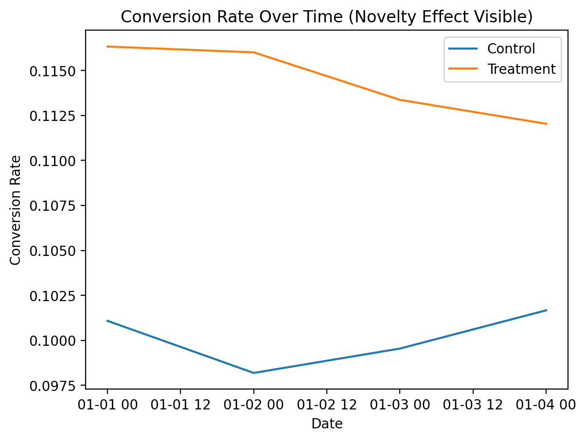

# A/B Experimentation & Decision Framework

## Overview
This project implements an end-to-end A/B experimentation system designed to evaluate product changes and output **ship / rollback decisions** using statistically grounded methods. The framework mirrors how large-scale product teams run experiments in production, emphasizing experiment validity, bias detection, and business guardrails rather than relying solely on p-values.

The system is built to answer one core question:

**Should this change be shipped?**

---

## Problem Statement
Product teams often ship changes based on incomplete or misleading experimental results. Common failure modes include:
- Invalid experiment splits (Sample Ratio Mismatch)
- Over-reliance on statistical significance without practical impact
- Ignoring guardrail metrics such as latency
- Early stopping and novelty effects inflating perceived lift

This project addresses these issues by enforcing validation, statistical rigor, and decision logic throughout the experimentation lifecycle.

---

## System Design
The experimentation framework consists of the following stages:

### 1. Experiment Validation
- Detects Sample Ratio Mismatch (SRM) using a chi-square test
- Blocks downstream analysis if the experiment is invalid

### 2. Metric Computation
- Conversion rate
- Revenue per user
- Latency (guardrail metric)

### 3. Statistical Testing
- Two-proportion z-test for conversion rate
- Welch’s t-test for revenue
- Effect size evaluated alongside p-values

### 4. Bias & Robustness Checks
- Early stopping (peeking) simulation
- Novelty effect analysis using time-based trends
- Conflicting metric scenarios (conversion vs revenue vs latency)

### 5. Decision Engine
- Combines statistical significance, practical impact, and guardrails
- Outputs one of:
  - `SHIP CHANGE`
  - `CONTINUE EXPERIMENT`
  - `ROLLBACK DUE TO LATENCY`
  - `INVALID EXPERIMENT`

---

## Results
The experiment demonstrated:
- A statistically significant and practically meaningful lift in conversion
- A corresponding increase in revenue per user
- A controlled latency increase within acceptable thresholds
- A novelty effect where early lift decayed but stabilized above control

### Conversion Rate Over Time

---

## When NOT to Trust the Results
The framework explicitly flags scenarios where results should not be acted upon:
- Sample Ratio Mismatch is detected
- The experiment is underpowered
- Lift is statistically significant but not practically meaningful
- Guardrail metrics (e.g., latency) exceed thresholds
- Metrics conflict in a way that increases business risk

---

## Tech Stack
- Python
- Pandas, NumPy
- SciPy
- Matplotlib

---

## Project Structure

---

## Key Takeaways
- Statistical significance alone is insufficient for shipping decisions
- Experiment validity and guardrails are critical in production environments
- Time-based analysis is necessary to detect novelty effects
- Decision systems should prioritize business impact, not just metrics

---

## Next Steps
Potential extensions include:
- Power analysis and sample size planning
- Multi-metric optimization strategies
- Bayesian experimentation approaches
