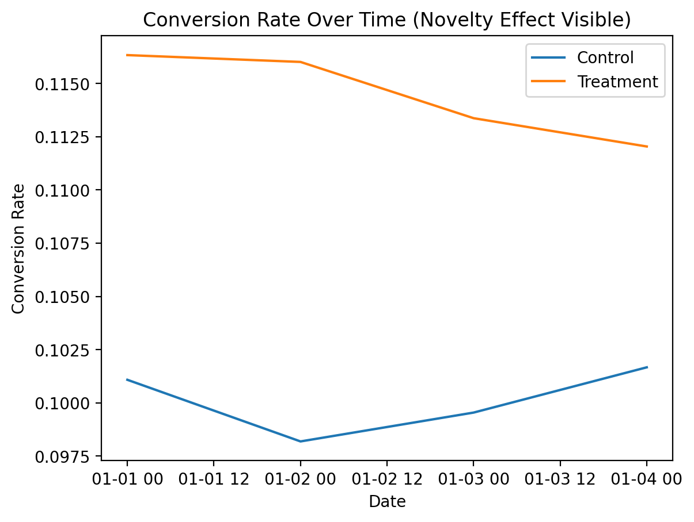

# A/B Experimentation & Decision Framework

[](https://github.com/kadaru242003/ab-experimentation-framework/actions/workflows/tests.yml)

## Overview
This project implements an end-to-end A/B experimentation system designed to evaluate product changes and output **ship / rollback decisions** using statistically grounded methods. The framework mirrors how large-scale product teams run experiments in production, emphasizing experiment validity, bias detection, and business guardrails rather than relying solely on p-values.

The system is built to answer one core question:

**Should this change be shipped?**

---

## Problem Statement
Product teams often ship changes based on incomplete or misleading experimental results. Common failure modes include:
- Invalid experiment splits (Sample Ratio Mismatch)
- Over-reliance on statistical significance without practical impact
- Ignoring guardrail metrics such as latency
- Early stopping and novelty effects inflating perceived lift

This project addresses these issues by enforcing validation, statistical rigor, and decision logic throughout the experimentation lifecycle.

---

## System Design
The data is a simulated experiment of 300,000 synthetic users (`src/generate_data.py`): a random 50/50 split, a 10% baseline conversion rate, a treatment lift that decays from +1.8pp to +1.2pp over the run (novelty effect), gamma-distributed revenue for converters, and a +15 ms latency cost in treatment. Users arrive one per second, so the run covers about 3.5 days.

The experimentation framework consists of the following stages:

### 0. Planning: Power Analysis
- Required sample size per group for conversion and continuous metrics
- Achieved power for a given sample size
- Test duration from daily traffic and allocation (see [Power Analysis](#power-analysis))

### 1. Experiment Validation
- Detects Sample Ratio Mismatch (SRM) with a chi-square goodness-of-fit test against the intended 50/50 split, flagged at p < 0.001 by default (`check_srm(df, threshold=...)`). The strict threshold is the common industry choice: the check runs on every experiment, so it should rarely raise false alarms, while real assignment bugs give tiny p-values
- If SRM is flagged, the decision is `INVALID EXPERIMENT` no matter how significant the metric results are

### 2. Metric Computation
- Conversion rate
- Revenue per user
- Latency (guardrail metric)

### 3. Statistical Testing
- Two-sided, pooled two-proportion z-test for conversion rate
- Welch’s t-test (unequal variances) for revenue per user
- Absolute lift checked against a practical-significance threshold (0.5pp) alongside the p-value

### 4. Bias & Robustness Checks
- Early stopping (peeking): re-runs the conversion test every 5,000 users and reports the first look where p < 0.05, showing how early a team that peeks would have stopped (here after 10,000 users, well before the planned sample size)
- A/A simulation (`aa_simulation.py`): 2,000 experiments with no true effect, measuring how much peeking inflates the false positive rate and how Bonferroni and O'Brien-Fleming corrections bring it back (see [Peeking: A/A Simulation](#peeking-aa-simulation))
- Novelty effect analysis using daily conversion trends by group
- Decision rules for conflicting metrics (conversion up but revenue down, or latency up)

### 5. Decision Engine
- Combines statistical significance, practical impact, and guardrails, checked in this order:
  - `INVALID EXPERIMENT`: SRM detected
  - `CONTINUE EXPERIMENT`: conversion lift not significant (p ≥ 0.05)
  - `NO PRACTICAL IMPACT`: significant, but absolute lift < 0.5pp
  - `DO NOT SHIP: REVENUE RISK`: revenue per user went down
  - `ROLLBACK DUE TO LATENCY`: average latency rose by more than 20 ms
  - `SHIP CHANGE`: none of the above

---

## Results
On the simulated data the pipeline outputs `SHIP CHANGE`: conversion 9.99% → 11.48% (z = 13.2), revenue per user $5.94 → $6.90 (Welch p ≈ 2.5e-30), latency +15.2 ms (under the 20 ms guardrail), and no SRM (p = 0.22). The experiment demonstrated:
- A statistically significant and practically meaningful lift in conversion
- A corresponding increase in revenue per user
- A controlled latency increase within acceptable thresholds
- A novelty effect where early lift decayed but stabilized above control

### Conversion Rate Over Time


---

## When NOT to Trust the Results
The decision engine flags scenarios where results should not be acted upon:
- Sample Ratio Mismatch is detected
- Lift is statistically significant but not practically meaningful
- Guardrail metrics (latency, revenue) move the wrong way
- Metrics conflict in a way that increases business risk

Results also should not be trusted when the experiment is underpowered or was stopped early after peeking. The decision engine does not check these automatically; use the power analysis module to fix the sample size and duration before launch, and analyze only once that sample is reached (or use a sequential boundary, as in the A/A simulation below).

---

## Peeking: A/A Simulation
`src/aa_simulation.py` runs 2,000 simulated experiments in which both groups convert at 10%, so any "significant" result is a false positive. Each experiment has 10,000 users per group, checked every 1,000 users per group (10 looks), with a fixed seed (42). Every look uses the same pooled two-sided z-test as the main pipeline.

| Method | Rule | False positive rate | 95% CI (Wilson) |
|---|---|---|---|
| Single test at planned sample size | one test at 10,000 per group, p < 0.05 | **5.15%** (103 / 2,000) | 4.3% – 6.2% |
| Peeking | stop at the first look with p < 0.05 | **19.05%** (381 / 2,000) | 17.4% – 20.8% |
| Bonferroni | stop at the first look with p < 0.05 / 10 | **2.20%** (44 / 2,000) | 1.6% – 2.9% |
| O'Brien-Fleming boundary | stop at look k if \|z\| ≥ 2.087 · √(10 / k) | **5.10%** (102 / 2,000) | 4.2% – 6.2% |

Checking ten times and stopping at the first significant result nearly quadruples the false positive rate, from about 5% to about 19%. Bonferroni fixes this but overcorrects. The O'Brien-Fleming boundary is very strict at early looks (|z| ≥ 6.6 at the first look) and close to 1.96 at the last one. It keeps the overall rate at 5% while still allowing an early stop for a large effect. The boundary constant is solved numerically and matches published tables (Jennison & Turnbull, *Group Sequential Methods*, Table 2.3).

```bash
cd src && python aa_simulation.py
```

---

## Power Analysis
`src/power.py` sizes an experiment before it runs. All functions use the standard normal approximation, assume equal-sized groups, and accept `alternative="two-sided"` (default) or `"one-sided"`.

| Function | What it returns |
|---|---|
| `sample_size_two_proportions(baseline, mde, alpha, power, relative, alternative)` | Users per group for a conversion-rate test. `mde` is absolute (0.01 = +1pp) or relative (`relative=True`, 0.10 = +10%) |
| `sample_size_means(sd, mde, alpha, power, alternative)` | Users per group for a difference in means (e.g. revenue per user) |
| `power_two_proportions(baseline, mde, n_per_group, ...)` | Achieved power for a conversion test with a given sample size |
| `power_means(sd, mde, n_per_group, ...)` | Achieved power for a difference in means |
| `experiment_duration_days(n_per_group, daily_traffic, traffic_allocation, treatment_share)` | Days until the smallest group reaches `n_per_group` |

Formulas (with `z_a = Φ⁻¹(1 − α/2)` two-sided or `Φ⁻¹(1 − α)` one-sided, `z_b = Φ⁻¹(power)`, `p̄ = (p1 + p2)/2`):

```
proportions:  n = [z_a·√(2·p̄(1−p̄)) + z_b·√(p1(1−p1) + p2(1−p2))]² / (p2 − p1)²
means:        n = 2·σ²·(z_a + z_b)² / δ²
duration:     days = ⌈n / (daily_traffic · allocation · min(share, 1 − share))⌉
```

The tests check these against textbook values (10% → 12% at α = 0.05, 80% power needs 3,841 per group; Cohen's d = 0.5 needs 63 per group) and against `statsmodels`.

### Worked example
Plan a test to detect a 10% relative lift on a 10% baseline conversion rate, with 20,000 visitors a day and half of them enrolled:

```python
from power import (sample_size_two_proportions, power_two_proportions,
                   sample_size_means, experiment_duration_days)

n = sample_size_two_proportions(baseline=0.10, mde=0.10, relative=True,
                                alpha=0.05, power=0.80)
# 14,751 users per group (10% -> 11%)

experiment_duration_days(n, daily_traffic=20_000, traffic_allocation=0.5)
# 3 days (5,000 users per group per day)

power_two_proportions(baseline=0.10, mde=0.10, n_per_group=5_000, relative=True)
# 0.37: stopping after one day would leave a 63% chance of missing a real lift

sample_size_means(sd=22.17, mde=0.50)
# 30,863 users per group to detect a $0.50 change in revenue per user
# (sd = 22.17 is the control-group revenue SD in the simulated data)
```

For the simulated experiment itself, detecting the long-run +1.2pp lift at 80% power needs 10,330 users per group. With about 150,000 users per group, the run has power ≈ 1.0 for that lift.

---

## Tech Stack
- Python
- Pandas, NumPy
- SciPy
- Matplotlib

---

## Project Structure
```
src/
  generate_data.py    # simulate 300,000 users -> data/experiment_data.csv
  run_experiment.py   # SRM check, metrics, tests, final decision
  validation.py       # chi-square SRM check
  metrics.py          # per-group conversion, revenue, latency
  stat_tests.py       # two-proportion z-test, Welch's t-test
  decision.py         # ship / continue / rollback rules
  peeking_bias.py     # early-stopping simulation on the experiment data
  aa_simulation.py    # A/A simulation: peeking false positive rates and corrections
  time_analysis.py    # conversion over time (novelty effect)
  visualize.py        # reports/conversion_over_time.png
  power.py            # sample size, power, test duration
  test_*.py           # ad-hoc scripts that print results on the generated data
tests/                # pytest suite (run in CI on every push)
notebooks/
  experiment_walkthrough.ipynb  # runnable end-to-end walkthrough (executed in CI)
reports/
```

## Running
```bash
pip install -r requirements-dev.txt
mkdir -p data && cd src
python generate_data.py && python run_experiment.py
cd .. && pytest
```


---

## Key Takeaways
- Statistical significance alone is insufficient for shipping decisions
- Experiment validity and guardrails are critical in production environments
- Time-based analysis is necessary to detect novelty effects
- Decision systems should prioritize business impact, not just metrics

---

## Next Steps
Potential extensions include:
- Apply a sequential boundary (e.g. O'Brien-Fleming) inside the decision engine so live results can be checked early without inflating false positives
- Multi-metric optimization strategies
- Bayesian experimentation approaches
